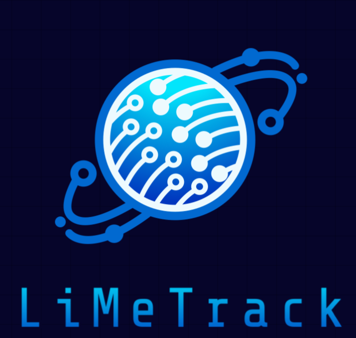
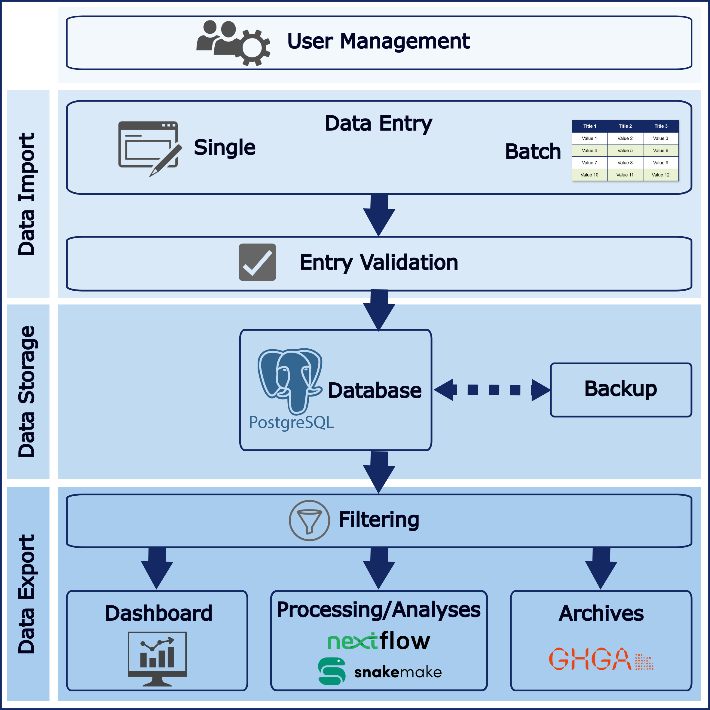

[](https://www.python.org/downloads/release/python-310/) 

# LiMeTrack – Lightweight Biosample Management Platform

<p align="center">
  
</p>

**LiMeTrack** is a lightweight, modular biosample management platform designed to streamline centralized research data handling and sample tracking within biomedical research projects.

Key features include an intuitive, customizable interface for data entry and a real-time dashboard providing clear insight into sample and project status. LiMeTrack simplifies the generation and export of standardized sample sheets, enhancing the efficiency of downstream bioinformatics analyses and overall research workflows.
By integrating robust data management with dynamic monitoring tools, LiMeTrack supports research transparency, promotes reproducibility, and ensures data integrity.
Users can submit data through a web form or by uploading CSV/Excel files. Once accepted, submissions are presented in a searchable, filterable sample table.

**LiMeTrack** was originally developed for the multicenter [SATURN3 consortium](https://saturn3.org). To adapt the platform to other use cases, the code and data model must be customized accordingly. We are actively working on modularizing the data models to facilitate broader adaptability across research projects.

<p align="center">
  
</p>

---

## Prerequisites

- [Docker](https://www.docker.com/get-started/)
- Working knowledge of Django and Python

---

## Customizing LiMeTrack for Your Project

To use LiMeTrack with your own data model, you’ll need to adjust several components:

### 1. Define Model Fields, Permissions, and Validators

LiMeTrack is built on Django's ORM. Define your data fields in `backend/gui/model.py`.
In our reference use case, a single model is split into multiple *sections* to manage user permissions (`end_of_model_section_dict` & `permissions`).

User permissions can be defined for the ability to:
1. **Fill in** empty fields of specified sections
2. **Edit** pre-filled fields
3. **Add** new records
4. **Delete** existing records

All permission logic is embedded within the model class itself.

### 2. Modify the Model Form

The model is rendered as a single unified form in the frontend, located in `backend/gui/forms/forms.py`.
The module `backend/gui/utils/model_to_form.py` transforms the model structure into the appropriate form layout and logic.

We display the full form to all users but restrict interaction based on permissions:
- Fields not permitted for editing are disabled and grayed out.
- Omics-related fields are only visible to users with the relevant permissions.

### 3. Update Templates and Example Files

In `backend/gui/views/download_views.py`, the `example_sample` list provides a mock sample demonstrating what a fully completed entry should look like.
You can find sample upload files in the `csv-files/` directory (CSV and XLSX formats).
These should be updated to reflect changes to your data model.

### 4. Adapt Column Filters in the Samples Table

Column filters are defined in `backend/gui/forms/forms.py`.
These filters allow users to toggle between relevant subsets of data for clarity.

Filtering logic is implemented in `backend/gui/views/samples_view.py`, which references predefined lists of fields that correspond to:
- Model sections
- Logical field groupings relevant to specific workflows

### 5. Update Selenium Test Cases

We use Selenium for basic integration testing, simulating user input for both form-based and file-upload workflows.
Form inputs in particular will require updating to reflect changes in your model.
Tests are located in `backend/gui/selenium/`.

### 6. Additional Information

Refer to inline code documentation throughout the project for further details.

---

## Getting Started

> ⚠️ **Important:** This repository is not intended for production use without thorough review and adaptation to your specific project requirements.

### Local Development & Debugging

```bash
docker compose -f docker-compose-local.yml -f docker-compose-develop.yml up --remove-orphans
```

Afterwards, create a first user for login:

```
docker exec -it limetrack-saturn3sample-django-1 sh

# now, in the container:
python manage.py createsuperuser
```
